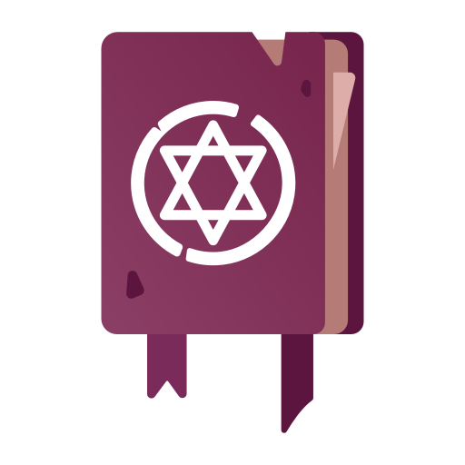

<p align="center">
    
</p>

<p align="center"><b>Write documentation for your modular Laravel projects.</b></p>


# 📜 Maestriam/Grimorium

**Maestriam/Grimorium** is a simple package to create awsome documentation for you modular-based project.  
**Under construction!**

## Requirements

- Laravel 6.*^ 

## Installation

**Install via composer**
``` bash
composer require maestriam/grimorium
```